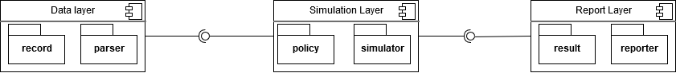

# Cache Simulator for OpenDC
[](https://codecov.io/gh/lyrakisk/cache-simulator)

This project is a trace-driven cache simulator built with Java11. It was built with the intention to be integrated into [OpenDC](https://opendc.org/), but it can be used as a stand-alone project.
 
It is built in a 3-layer architecture

consisting of 3 layers:
- Parser
- Simulation
- Report  

More information about these layers and the different components can be found in the  [API Documentation](https://github.com/lyrakisk/cache-simulator/wiki/API-Documentation).

# Dependencies
In order to build this project you will need:
- [Gradle 5.4.1](https://gradle.org/releases/)
- [jdk 11](https://www.oracle.com/java/technologies/javase-jdk11-downloads.html)

# How to use 

## Run the simulator with an IDE
- Install [IntelliJ IDEA Ultimate](https://www.jetbrains.com/idea/)
- Import the project as a Gradle project.
- Configure custom.yml as described in the [API Documentation](https://github.com/lyrakisk/cache-simulator/wiki/API-Documentation)
- Build the project.
- Run the Main class.  

## Run the simulator without an IDE
* Configure custom.yml as described in the [API Documentation](https://github.com/lyrakisk/cache-simulator/wiki/API-Documentation)
* Open a terminal window, cd to the project's root folder and run: 
  - ``` gradle build ```
  - ``` gradle run ```
  
# Deployment
You can deploy this project either as an application or as a library.  
Before deploying, you need to import and build the project in your IDE as described above or build it without an IDE using ``` gradle build ```. 
 
## Application distribution
The application is distributed as a .zip and as .tar file. These zipped files contain all the necessary libraries that the application needs to run, as well as a shell script that puts these libraries to the CLASSPATH. 
- You can find these distributions in the build/distributions folder.  
- Unzip the the .tar or .zip file inside a folder.
- Go to bin/configuration and create a custom.yml file. You can use the default.yml file as a reference.
- Modify custom.yml to configure the application according to the [API Documentation](https://github.com/lyrakisk/cache-simulator/wiki/API-Documentation)
- Open a terminal.
- ```cd``` to the bin folder.
  - **Linux/Mac users:** Run ```./opendc```
  - **Windows users:** Run ```opendc.bat```
- If you don't specify a different path for the results to be stored, you can find them in the bin folder.

## Library distribution
If you want to use the project as a library you need to:
- Build the project as described above.
- Go to build/libs and you will find a jar file that contains all the classes of the simulator. 
- You can learn how to use these classes in the [API Documentation](https://github.com/lyrakisk/cache-simulator/wiki/API-Documentation) 
